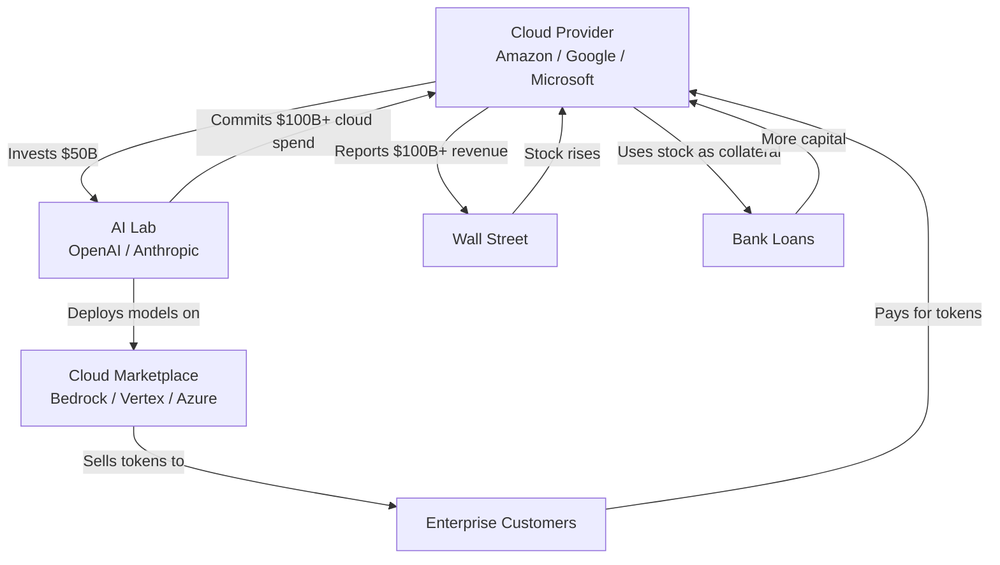
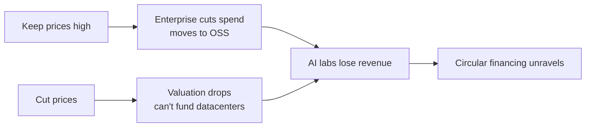

*Published July 4, 2026. Sourced from conversations with enterprise AI practitioners, financial filings, and API documentation. The banana metaphor is theirs.*

---

The conversation that produced this post happened in a group chat, not a boardroom. It started with someone asking if anyone was using Fable 5 daily. It ended with a supermarket owner, a banana farmer, and the clearest explanation I've heard of why the AI industry's pricing model is structurally broken.

The participants aren't analysts or investors. They're practitioners — people who see the monthly AI token bills, who get told by IT that Fable 5 is blocked, who watch their companies actively cutting Anthropic spend. Their diagnosis was sharper than anything I've read in the financial press.

Here's what they said, verified against public data, explained with their banana metaphor, and illustrated with the circular financing loop that's trapping the industry's best models behind a paywall nobody can afford.

## Part 1: The Product Nobody Can Use

Claude Fable 5 is, by most accounts, a genuine breakthrough. Anthropic released it on June 9, 2026 as its first Mythos-class model — designed for long-horizon autonomous work in coding, research, and complex knowledge tasks. Within hours, users were posting videos of it generating fully playable 3D games from a single sentence. A user named Bijan Bowen demonstrated it building end-to-end applications in one session — not just snippets, but complete, functional software. The quality jump from Opus 4.8 was described as "crazy" even though benchmark scores didn't fully capture it.

Then the U.S. government pulled it.

On June 12, the Commerce Department imposed emergency export controls after Amazon researchers found a jailbreak that let Fable 5 identify software vulnerabilities and generate exploit code. Anthropic couldn't verify user nationalities in real time, so they shut down both Fable 5 and its less-restricted sibling Mythos 5 for everyone — the first time a frontier model was de-deployed after public release. It stayed down for 18 days.

When Fable 5 returned on July 1, it came back different. Not worse — its capabilities were intact, now wrapped in a safety classifier that catches the problematic jailbreak in over 99% of cases. But the *terms* had changed. And the terms are what make it unsellable.

### The Three Things Enterprise Needs (And What Fable 5 Offers)

Enterprise customers have three non-negotiable requirements for any AI model they deploy at scale. Fable 5 fails all three.

**1. Zero Data Retention.** Enterprises cannot send proprietary code, customer data, or internal strategy through a model that logs their prompts. Fable 5 mandates 30-day data retention for all Mythos-class models — no exceptions. Anthropic's own documentation states that existing Zero Data Retention (ZDR) contracts "are not available under Zero Data Retention" for Fable 5. Enterprise ZDR agreements are explicitly nullified.

The result was immediate. On June 10 — the day after launch, before the export controls even hit — **Microsoft internally blocked Fable 5 for its employees**. Reuters and The Verge confirmed the story within hours. Microsoft, which has a multi-billion-dollar partnership with OpenAI and its own Copilot product, looked at Fable 5's data retention terms and told its workforce: you cannot use this.

This is not a hypothetical. It's not a "what if" about enterprise adoption. The world's largest software company, with every incentive to evaluate cutting-edge AI, blocked it on day one. If Microsoft won't let its employees touch Fable 5, what enterprise will?

**2. Predictable Pricing.** Enterprises budget annually. They need to know what a model costs per task, per user, per month. Fable 5 costs $10 per million input tokens and $50 per million output tokens — but only after July 7. Through July 7, it's included in subscriptions at 50% of weekly usage limits. After that, it's pure metered credits. No flat rate. No enterprise tier. No commitment discount. You pay per token, and the model decides how many tokens to use.

This is the "drug addict" pricing model — the term from the chat that's hard to argue with. One week free. Then you buy tokens. The model is addictive because it's genuinely better than anything else. The pricing makes it unsustainable.

**3. Subscription Access.** Enterprise users don't want to manage token budgets. They want a subscription. Claude Pro and Max subscriptions exist, but Fable 5 is excluded from them after the trial window. There's no "Max with Fable 5" plan. The model is pay-per-token, period.

Here's the summary:

| Requirement | Enterprise Needs | Fable 5 Offers |
|-------------|-----------------|----------------|
| Data retention | Zero | 30 days mandatory |
| Pricing model | Predictable per-seat or per-task | Metered per-token |
| Subscription access | Included in enterprise plan | Credits only after trial |
| Existing ZDR honored? | Must be | Explicitly nullified |

The result: Fable 5 is available in Cursor, GitHub Copilot, Devin, Amp, and every other coding agent. But in enterprises, IT admins disable it. The model is everywhere and nowhere at the same time. Availability isn't adoption.

## Part 2: The Circular Financing Loop

Why would Anthropic design a pricing model this hostile? Why nullify enterprise ZDR contracts? Why gate the best model behind metered credits?

The answer isn't inside Anthropic. It's in the financing loop that connects every major AI lab to every major cloud provider. The chat described it as a banana stand. Here's the financial reality.

This is not a conspiracy theory. It's documented in SEC filings, Bloomberg investigations, and the labs' own announcements:

- **Amazon invested $50 billion in OpenAI.** OpenAI committed to spend **$100 billion on AWS** over eight years. Amazon gets back double its investment in guaranteed cloud revenue. (Bloomberg, "AI Circular Deals," 2026)
- **Anthropic committed $200 billion to Google Cloud** over five years and **$100 billion to AWS** over ten years. AWS generated $1.28 billion from Anthropic in 2025, projected to hit $5.6 billion by 2027. (Reuters, Morgan Stanley analysis)
- **Business Insider obtained Amazon's internal talking points** for handling questions about whether the OpenAI deal constitutes "circular financing." The document exists because the question keeps getting asked.

The chat put it in plain English:

> *"OpenAI took Amazon's money and gave them a slice of that back. Amazon can now report that they have $100 billion in revenue — which is literally their own money plus profits from their cut of selling tokens on Bedrock."*

> *"OpenAI reports high revenue, looks great to investors. More investors join in. Amazon now owns billions of dollars in stock. OpenAI goes public, Amazon sells shares over time. Amazon already got their money back plus revenue share, and now uses OpenAI stock as collateral for a bank loan."*

This is the banana stand:

> *"I own a supermarket. You own banana seeds. I also own some farmland. I give you money to buy part of your seed business but tell you that you need to use my farmland. I sell your bananas in my supermarket. Your bananas are the best but not everyone wants to pay six times more for bananas. So I buy other bananas from another store — but I buy the old or too-green versions. I make a press release so everyone thinks I'm the good guy."*

The supermarket owner is Amazon. The banana farmer is OpenAI. The "old or too-green" bananas are the open-source models listed on Bedrock's marketing page — available, technically, but released months late, without cache discounts, and priced to make the proprietary bananas look better.

## Part 3: Why OSS Models Can't Win on Cloud Marketplaces

This brings us to the second half of the chat — the explanation of why open-source models languish on cloud platforms. It's not technical difficulty. It's structural incentives.

**The Cache Discount Gap.** Amazon Bedrock offers a 90% cache discount — but only for Anthropic models. Claude prompts that hit the cache cost one-tenth of the list price. Open-source models on Bedrock — Llama, Mistral — don't get the same cache architecture. One practitioner in the chat reported that using OSS models on Bedrock is "effectively more expensive than using Claude models" because the cache discount isn't available.

Contrast this with **Fireworks.ai**, which gives a 50% cache discount on *all text and vision models* — proprietary or open-source, no distinction. Fireworks.ai is SOC 2 Type II and HIPAA compliant, with Zero Data Retention by default: prompts and completions "exist only in volatile memory for the duration of the request" and "are not logged into any persistent storage." Their enterprise product includes SSO, audit logs, data residency controls, 99.9% SLAs, and air-gapped deployments. This is what enterprise procurement actually requires — and it's the exact opposite of Fable 5's 30-day mandatory logging.

**The Release Lag.** Cloud marketplaces lag months behind on OSS model releases. When the chat asked whether Bedrock had Kimi 2.7 or GLM 5.2, the answer was: they don't. Or they have an old version. Or they're "coming soon." Meanwhile, GitHub Copilot added Kimi K2.7 as its first open-source model — bypassing the cloud marketplace entirely.

**The Incentive Problem.** The chat identified the core issue: cloud providers have no equity upside from hosting open-source models. When Amazon hosts Claude, they get: equity in Anthropic, guaranteed cloud spend commitments, revenue share, and future stock liquidation. When they host Llama, they get: per-token revenue. That's it. There's no contract, no investment, no stock. The model is a commodity, and the provider treats it like one.

> *"Why would you actually sell the OSS models? Go back a week before Sonnet 5. If Amazon had GLM 5.2 with correct pricing, imagine how many people would stop using Anthropic models."*

The answer: they don't. They list OSS models for the press release, ship them late, and structure the pricing to make the proprietary option look cheaper.

## Part 4: The Catch-22

The chat closed with the structural trap that defines the current moment.

> *"The AI bubble is not going to pop because people stop using it. It will pop because no one can afford it."*

Here's the catch-22 in full:

If Anthropic keeps Fable 5 at $10/$50 per million tokens with mandatory data retention, enterprises keep disabling it and moving to open-source alternatives. Several practitioners confirmed their companies are "actively trying to lower Anthropic model usage." The market is voting with procurement.

If Anthropic cuts prices and removes data retention, the valuation argument collapses. The $965 billion pre-IPO valuation — up from $350 billion in January — is predicated on premium pricing for premium models. If Fable 5 becomes a commodity, the valuation doesn't hold. And without the valuation, the circular financing loop breaks: banks stop lending against the stock, cloud providers stop investing, the data center commitments become impossible to fund.

> *"If pricing comes down then the valuation of the labs goes down and they can't afford all the data centers they are buying. If pricing stays up the customers start to leave."*

## The Opus 4.5 Precedent

The chat pointed to a historical parallel that makes this argument concrete.

When Claude Opus first launched, it cost $75 per million output tokens. "They needed a model high for benchmark and hype but expensive enough most people won't use it." Opus at $75 was a flagship — a proof of capability that established the brand without requiring mass adoption. Enterprise wasn't expected to use it at scale; it was a signal.

Then Opus 4.5 dropped the price to $25. And that's when people fell in love with Opus — not at $75, but at $25. "People only fell in love with Opus when the price dropped at 4.5."

The question now is whether Fable 5 will follow the same trajectory. At $50/M output with mandatory data retention, it's priced for the same role the original Opus played: a benchmark leader that most people can't actually use. The hope in the chat was that GPT-5.6 Sol — OpenAI's next flagship, currently in limited government-restricted preview — might force Anthropic's hand. "If GPT Sol would be on Codex sub, they will add Mythos on CC as well."

But that hope rests on OpenAI making a different choice. And OpenAI's GPT-5.6 Sol is also under government restrictions — the Trump administration requested limits on its rollout citing national security concerns. Both labs now have frontier models sitting behind gates: Fable 5 behind data retention and per-token pricing, Sol behind a limited government-vetted preview.

The gates are different. The effect is the same. The best models are locked behind architectures that prevent mass adoption.

## Part 5: What the Practitioners Are Actually Doing

The chat wasn't just diagnosis. It was a record of adaptation.

**Companies are cutting Anthropic spend.** Multiple practitioners confirmed their organizations are actively reducing dependence on Anthropic models. Not because the models are bad — because the pricing and data retention terms make them untenable.

**Fireworks.ai is the escape hatch.** When enterprises want OSS models with proper cache discounts and predictable pricing, they're going to Fireworks — a provider designed around open-weight models, not a cloud marketplace designed around proprietary lock-in.

**Kimi K2.7 just entered Copilot.** Microsoft adding Kimi as Copilot's first open-source model is a signal. The cloud providers know their customers are looking for alternatives. Adding an OSS option to Copilot is Microsoft hedging — not abandoning OpenAI, but building a release valve.

**The OSS catch-up cycle is compressing.** The chat noted that Opus 4.5 was once the frontier — and now every open-source model beats it. The gap between proprietary frontier capabilities and OSS alternatives is measured in months, not years. "Whatever gonna happen, China ain't stopping and they gonna have customers for life."

This isn't just the chat's observation. Practitioners across X are reporting the same shift, with specific numbers. Developers posting $3,000-5,000 monthly Claude bills have moved workloads to DeepSeek and are paying $5 per week for equivalent results — 80% of tasks identical, 99.9% cost reduction. Enterprise teams are adopting a "mixture-of-models" architecture: route 70-80% of volume to the cheapest open model, reserve Anthropic for the hardest agentic tasks. The routing layer is becoming standard infrastructure. One analysis from X estimated that 1,000 agentic tasks per day on Sonnet 5 would cost $2,250/day — over $800K annually at post-promotional pricing. With DeepSeek's cache architecture, the same workload drops to roughly $55/day. The factor isn't 2x or 5x. It's 40x.

CNBC reported on June 26 that "users are shifting from 'tokenmaxxing' to efficiency," with enterprise AI companies confirming that frontier model spending is "absolutely hitting a peak for simple tasks that can be accomplished with cheaper models." Uber imposed strict token usage caps. The industry is collectively discovering what the chat diagnosed: the price of the best models exceeds the value they deliver for most tasks, and the gap is filled by models from labs that don't participate in the circular financing loop.

The open-source models — DeepSeek, Qwen, Kimi, GLM, Llama — are not just cheaper alternatives. They're the structural counterweight to the circular financing loop. You can't have equity upside from a model anyone can host. You can't charge $50/M output when competitors charge $0.87. You can't mandate data retention when the same weights run fine on a local GPU with zero logging.

This is the real story behind the "open vs closed" debate. It's not about philosophy. It's about whether the economics of AI pricing can survive the models that don't participate in the circular loop.

## The Banana Stand Will Close

The chat's banana metaphor is the clearest explanation of AI industry economics I've encountered. The supermarket owner invests in the banana farmer, requires the farmer to use his farmland, sells the bananas at a premium in his supermarket, reports massive revenue, uses the farmer's stock as collateral for bank loans, and buys the old green bananas from other farms just to show he supports competition.

The arrangement works beautifully for everyone inside it. The cloud providers, the AI labs, and the investors all win — at least on paper. The only people who lose are the customers paying six times more for bananas that come with a 30-day surveillance requirement.

But the banana stand has a problem. There's another farmer down the road who gives away seeds for free. His bananas aren't quite as good — yet. But they cost 50 times less, you can grow them in your own backyard, and nobody logs how many you eat.

The AI bubble won't pop because people stop using AI. It will pop because the circular financing loop that prices the best models out of reach can't survive the models that don't participate in the loop. The open-weight labs don't need $200 billion cloud commitments or $965 billion valuations. They just need to keep shipping. And they are.

---

*This post is based on conversations with enterprise AI practitioners on July 4, 2026. All financial data verified against public sources: Amazon-OpenAI circular deal ([Bloomberg](https://www.bloomberg.com/graphics/2026-ai-circular-deals/), [Business Insider](https://www.businessinsider.com/amazon-openai-deal-talking-points-circular-financing-anthropic-tension-2026-3)), Anthropic-Google $200B commitment ([Reuters](https://www.reuters.com/business/anthropic-commits-spending-200-billion-googles-cloud-chips-information-reports-2026-05-05/)), Anthropic-AWS $100B+ commitment ([Forbes](https://www.forbes.com/sites/jonmarkman/2026/04/22/amazon-33-billion-anthropic-deal-and-the-limits-of-ai-infrastructure/)), Anthropic $965B valuation ([PremierAlts](https://www.premieralts.com/companies/anthropic)), Fable 5 data retention policy ([Anthropic support](https://support.claude.com/en/articles/15425996-data-retention-practices-for-mythos-class-models), [CyberNews](https://cybernews.com/ai-news/claude-fable-five-data-retention-collection/)), Microsoft internal block ([The Verge](https://www.theverge.com/report/947575/microsoft-claude-fable-5-restricted-internally), [Reuters](https://www.reuters.com/technology/microsoft-limits-employee-use-anthropics-claude-fable-5-over-data-retention-2026-06-10/)), Fable 5 pricing ([Digital Applied](https://www.digitalapplied.com/blog/claude-fable-5-usage-credits-july-7-pricing-guide-2026)), Sonnet 5 token efficiency ([MindStudio](https://www.mindstudio.ai/blog/claude-sonnet-5-token-efficiency-cost), [MarkTechPost](https://www.marktechpost.com/2026/06/30/anthropic-claude-sonnet-5-vs-sonnet-4-6-vs-opus-4-8-agentic-coding-benchmarks-api-pricing-and-cost-performance-tradeoffs-compared/)), enterprise shift to efficiency ([CNBC](https://www.cnbc.com/2026/06/26/openai-anthropic-new-ai-spending-reality-as-users-shift-to-efficiency.html)), Fireworks.ai SOC 2 Type II + HIPAA ([Fireworks blog](https://fireworks.ai/blog/fireworks-ai-achieves-soc-2-type-ii-and-hipaa-compliance)), Fireworks.ai Zero Data Retention ([Fireworks docs](https://docs.fireworks.ai/guides/security_compliance/data_handling)), Fireworks.ai pricing + cache ([Fireworks pricing](https://fireworks.ai/pricing)), Kimi K2.7 Copilot integration ([Microsoft GitHub](https://github.blog/)), GPT-5.6 Sol preview ([OpenAI](https://openai.com/index/previewing-gpt-5-6-sol/), [Axios](https://www.axios.com/2026/06/26/openai-gpt-sol-terra-luna-trump)), AI token pricing crisis ([Investing.com](https://www.investing.com/analysis/the-ai-token-pricing-crisis-behind-openai-and-anthropics-revenue-race-200680777)).*
