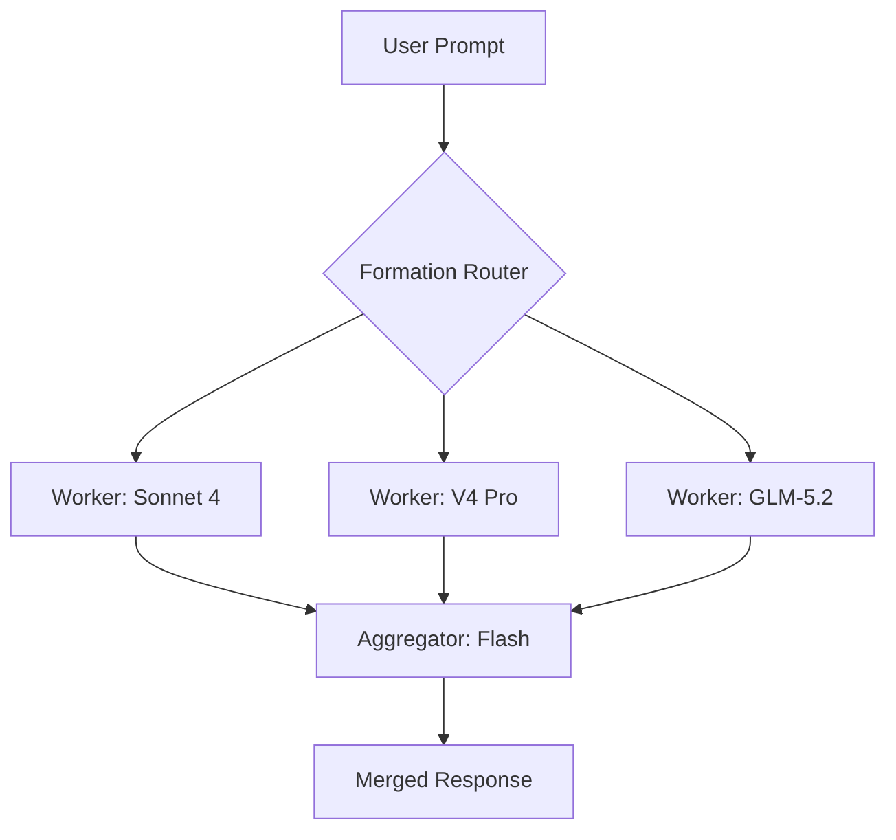
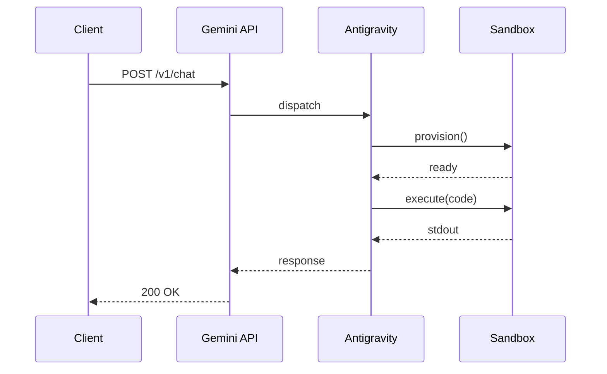

This post verifies that the blog infrastructure correctly renders tables, mermaid diagrams, and multiple images from a single markdown file.

## Tables

A benchmark comparison table:

| Model | GPQA Diamond | τ2-bench | ELO | Tok/s (4090) |
|-------|-------------|----------|-----|--------------|
| Gemma 4 31B | 84.3% | 86.4% | 1452 | 35 |
| DeepSeek V4 | 58.6% | 57.5% | 1425 | N/A |
| Llama 4 | 82.3% | 85.5% | 1430 | 28 |
| Qwen 3.5 27B | 71.2% | 68.1% | 1403 | 42 |

## Mermaid Flowchart

Architecture diagram for the Chimera deliberation system:

## Mermaid Sequence Diagram

Antigravity agent provisioning flow:

## Second Image

*Caption: The same abstract geometric hero image used here as a test for multiple image rendering with a caption.*

---

*This is a test post and will be deleted after verification.*
